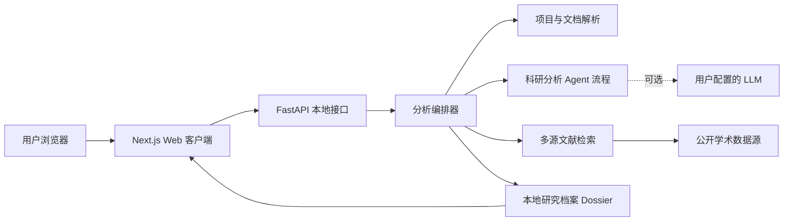
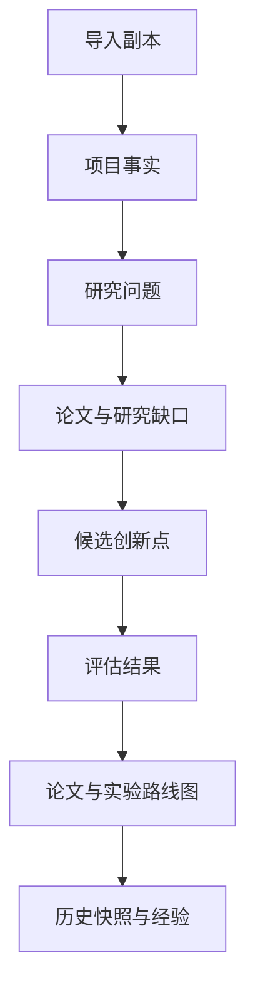

# PaperMine 系统架构

> 本文面向普通开源用户，说明 PaperMine 当前版本由哪些部分组成、一次分析如何完成，以及项目文件、LLM 和文献服务之间的数据流向。

## 1. PaperMine 是什么

PaperMine 是一个在用户电脑上运行的科研决策工具。它读取已有项目中的代码和文档，将工程工作整理为：

- 项目事实与研究叙事；
- 可研究的问题；
- 带文献依据的候选创新点；
- 可行性、风险和证据强度评估；
- 可执行的论文与实验路线图。

它的目标是帮助用户判断“现有工作中什么值得研究、还缺什么证据”，而不是代写可直接提交的论文。

## 2. 总体架构

PaperMine 采用“本地 Web 客户端 + Python 核心引擎 + 本地研究档案”的结构。浏览器只负责展示和操作，真正的项目读取、文档解析、检索编排和结果保存均由本机上的 Python 服务完成。



默认情况下，Web 和 API 只监听 `127.0.0.1`，也就是只能从当前电脑访问，不会自动向局域网或互联网开放。

## 3. 一次分析如何完成

### 3.1 导入项目

用户可以在 Web 客户端中选择文件夹或上传 ZIP。PaperMine 会把内容复制到自己的本地数据目录后再分析，不修改原始项目。

导入阶段会排除常见依赖目录、版本控制目录、密钥文件和其他不适合分析的内容，并对文件数量、单文件大小、总容量和解压行为设置安全限制。

### 3.2 本地读取与文档解析

项目理解首先在本机完成。当前主要支持：

| 内容 | 处理方式 |
|---|---|
| Python 代码 | AST 静态分析，并结合文件结构和文本信号提取模块、方法与数据线索 |
| 其他代码 | 按目录、文件名和可读文本提取线索 |
| PDF | 优先读取文本层；扫描页使用中英文 OCR |
| DOCX | 读取正文、表格、页眉页脚，并识别内嵌图片中的中英文文字 |
| PPTX | 读取幻灯片文字、表格、演讲者备注，并识别内嵌图片中的中英文文字 |
| Markdown、TXT、LaTeX 等 | 直接读取可解析文本 |

解析结果会受到字符数、页数、图片数和像素预算保护。遇到损坏、加密或无法识别的单个文档时，系统会保留其他可读内容并记录降级信息，而不是让整个项目分析失败。

### 3.3 科研分析流程

核心流程由六个分析角色和一个经验沉淀环节组成：


1. **项目理解**：从代码和文档中识别任务、方法、数据、场景、指标和已有成果。
2. **问题抽象**：把工程任务改写成可以验证的研究问题，并区分科研问题和普通工程改进。
3. **文献检索**：围绕研究问题搜索已有工作，形成论文证据与研究缺口。
4. **创新点生成**：结合项目事实和文献缺口提出候选方向，并说明创新边界。
5. **可行性评估**：从新颖性、证据、数据、工作量和风险等角度进行判断。
6. **路线规划**：生成研究问题、实验矩阵、阶段任务和待补材料。
7. **经验沉淀**：把本次分析中可复用的经验保存到本机，为后续项目提供参考。

文献检索和创新点生成之间可以循环校验；证据不足或方案不可行时，系统也可以回到前面的阶段重新分析。这样得到的是有证据约束的候选方向，而不是一次性的自由生成。

## 4. 文献证据系统

PaperMine 当前使用五个公开学术数据源：

- arXiv；
- Semantic Scholar；
- OpenAlex；
- Crossref；
- DBLP。

同一个研究方向会并行查询多个来源，再按照 DOI、arXiv ID 和规范化标题去重。单个来源超时、限流或暂时不可用时，其他来源仍可继续工作。

每个研究方向的目标是展示 8 篇论文，最多展示 12 篇。系统优先保留“高度相关”论文；数量不足时，会放宽查询并补充“部分相关”论文。Web 页面会明确显示论文数量、覆盖状态、相关性级别、匹配依据和来源，不会复制或虚构论文来凑数。

需要注意：公开数据库的覆盖范围并不等于全部学术文献，“当前没有检索到”不能直接证明某项工作不存在。PaperMine 因此把研究缺口视为证据范围内的判断，最终仍需用户阅读全文并人工核验。

## 5. 研究档案与数据流

每次分析都有一份版本化的研究档案（Dossier），它是该次分析的统一数据源。项目事实、研究问题、论文证据、候选创新点、评估和路线图都会逐步写入其中，Web 页面读取的也是这份档案。



默认数据位于 `PAPERMINE_HOME` 指定的目录；未指定时使用用户目录下的 `.papermine`。其中主要包括：

- `imports/`：从网页导入的项目副本；
- `runs/`：每次分析的 Dossier、报告、轨迹和历史快照；
- `literature_cache/`：公开文献检索缓存；
- `experience/`：跨项目积累的本地经验。

版本和快照机制使分析过程可以追溯，也让用户能够在 Web 客户端切换不同的历史运行结果。

## 6. LLM 的使用方式

PaperMine 支持两种运行方式：

### 配置用户自己的 API Key

系统使用用户在本机 `.env` 中配置的 LLM 服务。调用产生的费用和用量属于该 Key 的拥有者。项目会先在本地提取和整理内容，再把分析所需的结构化事实和必要片段交给模型，而不是直接上传完整项目目录。

### 不配置 API Key

系统使用确定性降级逻辑，不调用 LLM，也不会产生模型费用。项目扫描、文档解析、公开文献检索和基础报告仍能工作，但研究问题、创新点和评估通常会更模板化。

无论哪种方式，API Key 都只应保存在用户本机，不应提交到 GitHub。

## 7. Web 客户端与命令行

PaperMine 的不同入口共用同一个 Python 核心和同一种研究档案：

| 入口 | 适合用途 |
|---|---|
| Web 客户端 | 导入项目、观察分析进度、查看文献证据、比较候选方向和阅读路线图 |
| 命令行 | 自动化分析、检查状态、恢复中断任务、查看性能轨迹 |

启动 `papermine web` 时，启动器会同时管理本地 API 服务和 Web 服务，并默认打开浏览器。前端不会在浏览器中直接读取用户磁盘，也不会绕过 Python 核心单独生成分析结果。

## 8. 可靠性设计

系统通过以下机制避免一次局部故障破坏整个分析：

- **确定性解析优先**：能够在本地可靠提取的内容不交给模型猜测。
- **结构化交接**：各分析阶段通过统一研究档案交换结果。
- **缓存与复用**：文献检索、论文理解和模型结果尽量复用，减少等待和重复调用。
- **并行处理**：相互独立的文献来源和分析任务并行执行。
- **局部降级**：文档损坏、单个检索源失败或未配置 LLM 时，尽可能保留其他结果。
- **版本与轨迹**：记录运行状态、结果版本和关键调用，便于定位问题和防止性能回退。

## 9. 隐私与安全边界

- 服务默认仅在本机开放。
- 网页导入分析的是本地副本，不修改用户原目录。
- 常见密钥、凭据、依赖目录和无关大文件会在导入或分析阶段排除。
- 文档解析与 OCR 在本机完成。
- 只有配置了外部 LLM 时，必要的脱敏分析上下文才会发送给相应服务。
- 文献检索会向公开学术 API 发送检索词，但不会向这些来源上传用户的项目文件。

如果项目包含高度敏感信息，用户仍应在导入前自行检查内容，并优先使用不配置云端 LLM 的运行方式。

## 10. 当前能力边界

- PaperMine 提供研究决策支持，不保证候选方向一定新颖、可发表或适合特定期刊。
- 文献卡片和摘要不能替代阅读全文与正式的系统性文献综述。
- Python 代码能够进行 AST 分析；其他语言目前主要依靠文件结构和文本信号。
- 当前支持 `.pdf`、`.docx`、`.pptx`，不直接支持旧版 `.doc`、`.ppt`。
- OCR 仅针对中文和英文，效果受扫描质量、字体、排版和图片清晰度影响。
- Web 客户端当前定位为用户自己电脑上的桌面端本地服务，不是公网多用户平台。

## 11. 主要代码组成

```text
papermine/
  orchestrator.py   分析流程、检查点与回退控制
  dossier.py        版本化研究档案
  scanner.py        项目目录与文件扫描
  extractor/        代码、文档与 OCR 内容提取
  retrieval.py      五源文献检索、分层与去重
  literature.py     论文理解与证据整理
  agents/           项目理解、问题抽象、创新、评估、规划与反思
  experience.py     本地经验沉淀与生命周期
  llm.py            LLM 接口与无模型降级
  storage.py        本地数据目录管理
  trace.py          运行轨迹与性能检查
  web_launcher.py   本地 Web 与 API 的统一启动器

web/
  api.py            FastAPI 本地接口
  frontend/         Next.js 科研决策工作台
```

开发者需要了解接口约束、数据版本和模块任务记录时，可继续阅读工程规范及仓库内的开发计划文档；普通用户只需从本文和首页安装教程开始。
